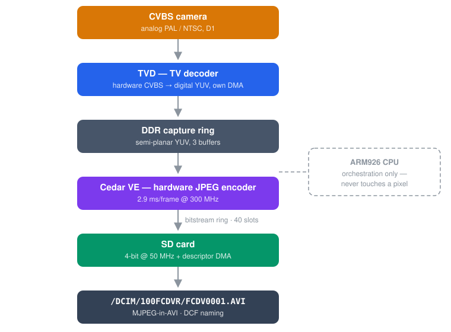
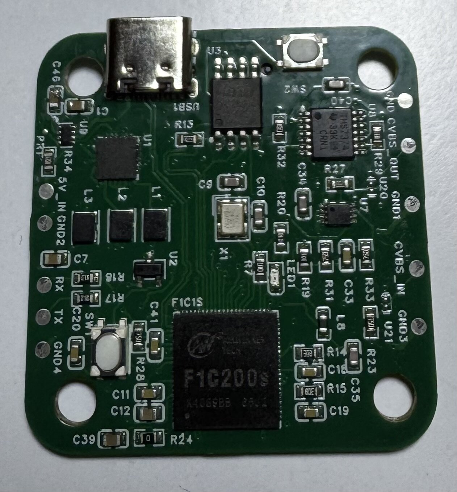

<p align="center"></p>

English | [Українська](README.uk.md)

Open-source airborne FPV DVR firmware for the Allwinner F1C200s.

Records an analog CVBS camera to SD card as MJPEG-in-AVI with near-zero CPU
load: every stage of the pipeline is a hardware peripheral, and the ARM926
core only orchestrates.



- **Bare metal** — no Linux, no RTOS. One binary, single main loop, a handful
  of interrupts.
- **Hardware MJPEG** — the F1C200s Video Engine encodes up to 1280×720@30
  (datasheet §2.5); the analog D1 frames (720×480/576) it records here are
  well inside that.
- **Flight-controller control** — implements the device side of the RunCam
  Device Protocol v1.0, so Betaflight, INAV and ArduPilot can start/stop/
  toggle recording out of the box. A GPIO/RC-PWM pin is the FC-less fallback.
- **Crash-safe by construction** — auto-record on video signal, 5-minute
  segments, preallocated files, periodic AVI header refresh: pulling the
  battery costs at most the last second of the current clip.
- **Record-only tap** — the DVR taps the camera line in parallel and adds
  nothing to the video chain. Tap high-impedance: the DVR input must NOT
  terminate the line; exactly one 75 Ω per link, and it belongs at the
  VTX/display end.
- **USB card reader built in** — plug the board into a computer and the SD
  card mounts as USB mass storage ("FPVault SD Card"); no card removal, no
  extra files on the card. Powered by anything that is not a computer
  (charger, FC 5 V), it records instead.

## Status

Early bring-up. Milestones:

- [x] M0 — skeleton: build, boot via U-Boot, console, LED, watchdog
- [x] M1 — Cedar VE hardware JPEG: **2.9 ms/frame on silicon** (VE 1663)
- [x] M2 — SD 4-bit + FatFs: **7.8 MB/s sustained, 64 MB bit-verified**
- [x] M3 — live capture → encode: **full 29.97 fps, IRQ pipeline, 0 drops**
- [x] M4 — crash-safe AVI recording with true color (TVD 4:2:0 → NV12)
- [x] M5 — autonomous recorder: auto-record on signal, 5-min segments,
      DCF naming, dropout policy, LED state UX
- [x] M6 — RunCam Device Protocol live on UART1 (Betaflight/INAV/ArduPilot)
      — *bench-tested against the fuzz suite; real-FC session pending*
- [x] M7 — endurance and fault-injection hardening: **80-minute
      uninterrupted soak, 16 consecutive 5-min segments, 144,000 frames,
      0 drops, every JPEG verified**; crash safety proven against 8 real
      unplanned power cuts (every clip playable to within 1 frame of the
      cut); stall injection passes. The soak also produced the supply
      errata in docs/HARDWARE-ERRATA.md — the bench board needed a bulk
      capacitor at the SD socket to survive soft supplies.
- [x] M8 — standalone SPI-NOR boot: cold power → recording in ~5 s
      (U-Boot with baked-in bootcmd at NOR 0, firmware at NOR 0x100000)
- [x] M9 — USB mass storage: connect to a computer, the card mounts
      (CherryUSB device stack on the MUSB controller, USB 2.0 High-Speed)

Power the board with a card inserted and it records — no host, no
commands.

Host test suite: `make -C tests/host` (no cross-toolchain needed).

## Hardware

### FPVault board v1



The purpose-built DVR board, 2-layer, four mounting holes. It sits inline
in the video link: `CVBS_IN` from the camera, `CVBS_OUT` to the VTX. The
bypass is analog — a THS7374 video amplifier feeds a TS5A3153 switch that
passes the camera straight to the output with the firmware doing nothing
(PE4 at its pull-down default), and the same amplifier taps the picture
for the F1C200s's decoder. Power comes from USB-C or a `5V_IN` pad
through a TPS2116 mux; `RX`/`TX` pads expose UART0. Same F1C200s + 16 MB
W25Q128 NOR + microSD + EA3059C core as the dev board, with SW1 reset and
SW2 for FEL (see docs/BRINGUP.md). Two units brought up and recording;
findings in docs/HARDWARE-ERRATA.md.

Schematic: [PDF](docs/hw/fpvault-board-v1-schematic.pdf) ·
[PNG](docs/hw/fpvault-board-v1-schematic.png)

### Development board


The generic F1C200s module everything was first brought up on: F1C200s
(under the heatsink), W25Q128 SPI-NOR, USB-C, microSD, CVBS `TV IN` pins
and a `TV_OUT` header, EA3059C PMIC. Its quirks are the first part of
docs/HARDWARE-ERRATA.md.

## Building

Needs `arm-none-eabi-gcc` (tested with 14.2) and GNU make.

```sh
make            # build/fpvault.bin
make deploy     # send to a board sitting at the U-Boot prompt (YMODEM)
```

The dev flow expects U-Boot on the board's SPI-NOR: `loady 0x80000000`,
then `go 0x80000000` — `make deploy` (tools/loader.py) does both. The serial
port defaults to `/dev/cu.usbserial-0001`; override with `make deploy
PORT=...`. Console: 115200 8N1 on UART0 (PE0/PE1), single-character commands,
`s` = state, `r` = reset.

## Hardware requirements

Any F1C200s board with: CVBS input to TV_IN, SD card on SDC0 (PF0–PF5,
4-bit), SPI-NOR on SPI0, UART0 console. UART1 (PA2/PA3) connects to the
flight controller for RunCam control. 64 MB (F1C200s) required — the DMA
arena does not fit the 32 MB F1C100s.

## License

GPL-3.0-or-later. See [CREDITS.md](CREDITS.md) for the vendored and derived
components and their origins.
