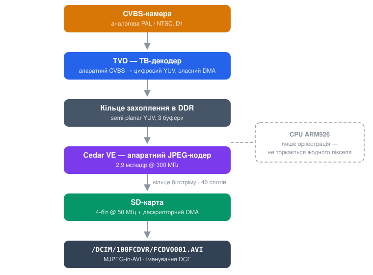
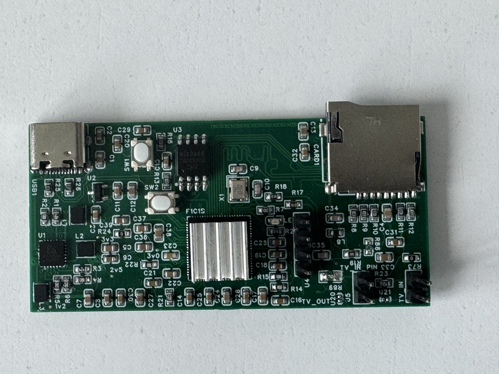

# FPVault

[English](README.md) | Українська

Прошивка бортового FPV-відеореєстратора з відкритим кодом для Allwinner
F1C200s.

Записує аналогову CVBS-камеру на SD-карту як MJPEG-in-AVI з майже нульовим
навантаженням на CPU: кожен етап конвеєра — апаратний периферійний блок, а
ядро ARM926 лише диригує.



- **Bare metal** — без Linux і без RTOS. Один бінарник, один головний цикл,
  кілька переривань.
- **Апаратний MJPEG** — Video Engine у F1C200s кодує до 1280×720@30
  (даташит §2.5); аналогові кадри D1 (720×480/576), які записуються тут,
  вкладаються з великим запасом.
- **Керування з польотного контролера** — реалізовано бік пристрою
  протоколу RunCam Device Protocol v1.0, тож Betaflight, INAV та ArduPilot
  вміють запускати/зупиняти/перемикати запис «з коробки». Пін GPIO/RC-PWM —
  запасний варіант без FC.
- **Стійкість до втрати живлення за побудовою** — автозапис за наявності
  відеосигналу, 5-хвилинні сегменти, попередньо виділені файли, періодичне
  оновлення заголовка AVI: висмикнута батарея коштує щонайбільше останньої
  секунди поточного кліпу.
- **Лише відгалуження для запису** — DVR під'єднується до лінії камери
  паралельно і нічого не додає у відеотракт. Відвід високоомний: вхід DVR
  НЕ повинен термінувати лінію; рівно один резистор 75 Ом на лінію, і його
  місце — на боці VTX/дисплея.
- **Вбудований USB-кардридер** — під'єднайте плату до комп'ютера, і
  SD-карта змонтується як USB-накопичувач ("FPVault SD Card"): карту виймати не
  треба, зайвих файлів на ній не з'являється. Від живлення, що не є
  комп'ютером (зарядка, 5 В від FC), плата натомість записує.

## Стан проєкту

Ранній етап. Віхи:

- [x] M0 — каркас: збірка, завантаження через U-Boot, консоль, світлодіод,
      watchdog
- [x] M1 — апаратний JPEG на Cedar VE: **2,9 мс/кадр на кремнії** (VE 1663)
- [x] M2 — SD 4-біт + FatFs: **7,8 МБ/с стабільно, 64 МБ звірено побітово**
- [x] M3 — живе захоплення → кодування: **повні 29,97 fps, конвеєр в IRQ,
      0 втрачених кадрів**
- [x] M4 — крешостійкий запис AVI з правильним кольором (TVD 4:2:0 → NV12)
- [x] M5 — автономний рекордер: автозапис за сигналом, 5-хв сегменти,
      іменування DCF, політика зникнення сигналу, LED-індикація станів
- [x] M6 — RunCam Device Protocol наживо на UART1 (Betaflight/INAV/
      ArduPilot) — *перевірено на стенді фаз-тестами; сесія зі справжнім FC
      попереду*
- [ ] M7 — витривалість і загартування ін'єкцією відмов — *ін'єкція затримок
      SD та відновлення після зникнення живлення пройдені; верифікація
      годинного запису попереду*
- [x] M8 — автономне завантаження зі SPI-NOR: від подачі живлення до запису
      за ~5 с (U-Boot із вшитим bootcmd у NOR 0, прошивка в NOR 0x100000)
- [x] M9 — USB mass storage: під'єднайте до комп'ютера — карта монтується
      (стек CherryUSB на контролері MUSB, поки що Full-Speed)

Подайте живлення на плату зі вставленою картою — і вона записує: без
хоста, без команд.

Набір тестів для хост-машини: `make -C tests/host` (крос-тулчейн не
потрібен).

## Апаратура



Плата розробки, на якій усе наведене вище було оживлено: F1C200s (під
радіатором), 16 МБ SPI-NOR W25Q128, USB-C (живлення + кардридер), слот
microSD, піни CVBS `TV IN` і гребінка `TV_OUT`, PMIC EA3059C. Особливості
цієї ревізії зібрані в [docs/HARDWARE-ERRATA.uk.md](docs/HARDWARE-ERRATA.uk.md).

Розробляється повноцінна плата DVR: аналоговий байпас, щоб пристрій міг
стояти в розриві відеолінії (камера на вході, VTX на виході — прошивка
залишається лише відгалуженням для запису; байпас — пасивний аналоговий),
плюс монтажні отвори та справжні контактні майданчики для паяння.

## Збірка

Потрібні `arm-none-eabi-gcc` (перевірено з 14.2) і GNU make.

```sh
make            # build/fpvault.bin
make deploy     # надіслати на плату, що стоїть у промпті U-Boot (YMODEM)
```

Цикл розробки розраховує на U-Boot у SPI-NOR плати: `loady 0x80000000`,
потім `go 0x80000000` — `make deploy` (tools/loader.py) робить обидва
кроки. Послідовний порт за замовчуванням — `/dev/cu.usbserial-0001`;
змінюється через `make deploy PORT=...`. Консоль: 115200 8N1 на UART0
(PE0/PE1), однолітерні команди, `s` = стан, `r` = скидання.

## Апаратні вимоги

Будь-яка плата F1C200s із: входом CVBS на TV_IN, SD-картою на SDC0
(PF0–PF5, 4-біт), SPI-NOR на SPI0, консоллю на UART0. UART1 (PA2/PA3)
з'єднується з польотним контролером для керування RunCam. Обов'язково
64 МБ (F1C200s) — DMA-арена не вміщується в 32 МБ F1C100s.

## Ліцензія

GPL-3.0-or-later. Перелік запозичених і похідних компонентів та їхнє
походження — у [CREDITS.uk.md](CREDITS.uk.md).
